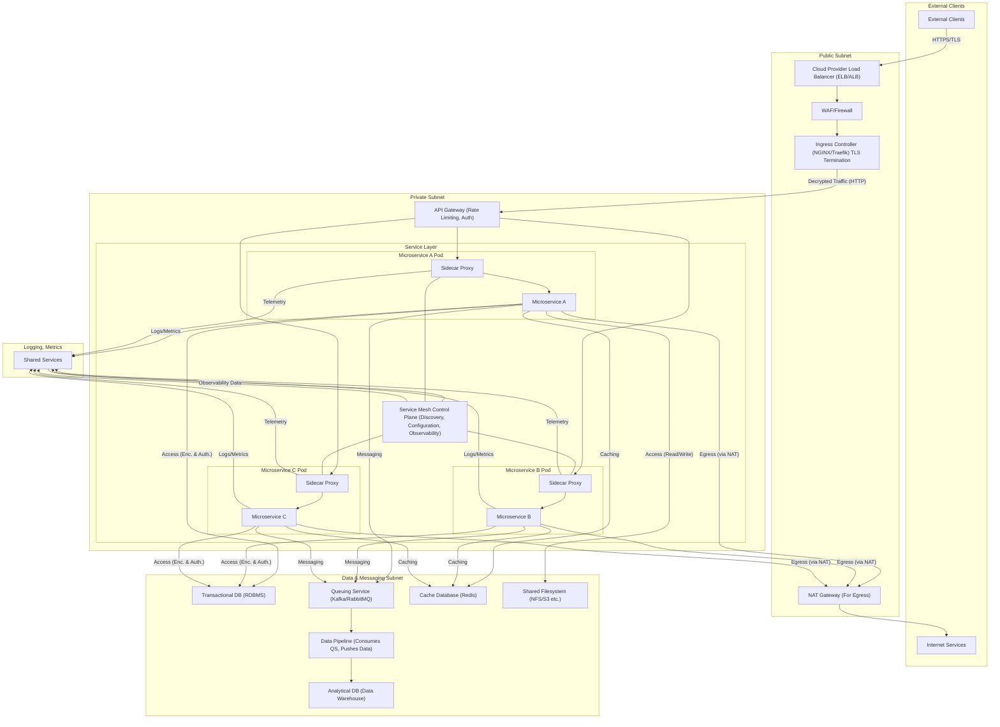

# Infrastructure Architecture: Secure Microservices Platform

🚧 **Work in Progress**  
_This architecture and documentation are actively being refined. Contributions and suggestions are welcome._

## 1. Overview
This document outlines the technical infrastructure of a secure, scalable, and cloud-native microservices platform. The architecture ensures modular deployment, traffic management, observability, and data handling across different subnets.

## 2. Network Layout
The infrastructure is divided into four primary subnets:

- **Public Subnet**: Handles ingress traffic, TLS termination, and egress routing.
- **Private Subnet**: Hosts microservices and internal APIs.
- **Data & Messaging Subnet** *(Private Subnet)*: Hosts transactional and analytical data stores, messaging queues, and caching layers.
- **Shared Services**: Common utilities such as logging and metrics collection.

## 3. Components

### 3.1 Public Subnet
- **NAT Gateway**: Facilitates secure outbound traffic from private subnets to the internet.
- **Cloud Load Balancer (ELB/ALB)**: Manages incoming client traffic distribution.
- **WAF/Firewall**: Inspects and filters traffic for security threats.
- **Ingress Controller (NGINX/Traefik)**: Performs TLS termination and routes HTTP traffic to internal services.

### 3.2 External Clients
- **Internet Services**: Publicly accessible endpoints and APIs.
- **External Clients**: End-users or systems consuming platform APIs over HTTPS.

### 3.3 Private Subnet
- **API Gateway**: Enforces rate limiting, authentication, and routes API requests to services.
- **Service Mesh Control Plane**: Handles service discovery, configuration distribution, and observability for sidecars.
- **Microservices**:
  - Each microservice runs in its own pod with a sidecar proxy for mesh integration.
  - Communication between services is managed via the service mesh.

### 3.4 Data & Messaging Subnet *(Private Subnet)*
- **Transactional Database (RDBMS)**: Used for core application data.
- **Queuing Service (Kafka/RabbitMQ)**: Enables decoupled communication between services.
- **Data Pipeline**: Consumes messages from the queue and pushes data to the analytics store.
- **Analytical Database (Data Warehouse)**: Stores processed data for reporting and analytics.
- **Cache Database (Redis)**: Supports caching of frequent reads and temporary storage.
- **Shared Filesystem (NFS/S3, etc.)**: Centralized file storage for read/write operations.

### 3.5 Shared Services
- **Logging, Metrics, and Tracing**: These services support observability and are connected to the control plane for collecting telemetry data.

## 4. Request and Data Flow

### 4.1 Downstream Request Flow
1. External Clients access the system via HTTPS.
2. The Load Balancer forwards traffic to the WAF.
3. WAF routes valid requests to the Ingress Controller.
4. Ingress performs TLS termination and sends HTTP traffic to the API Gateway.
5. API Gateway routes the traffic to the appropriate microservice proxy (sidecar).
6. Sidecars forward traffic to the actual microservices.

### 4.2 Microservices Data Access
- Each microservice communicates with:
  - **Queuing Service** for event publishing.
  - **Transactional DB** with encryption and authorization.
  - **Cache** for frequently accessed data.
  - **Shared Filesystem** (only Microservice A) for read/write file operations.

### 4.3 Analytical Data Flow
- Data produced by services is pushed to the **Queuing Service**.
- The **Data Pipeline** consumes from the queue and writes to the **Analytical DB**.

### 4.4 Service Mesh Communication
- The **Service Mesh Control Plane** configures and monitors all sidecars.
- Observability and configuration data flows from the **Shared Services** to the control plane.

### 4.5 Outbound/Egress Flow
- Microservices send egress traffic through the **NAT Gateway**.
- NAT routes the traffic to the **Internet**.
- **Based on the configured egress rules**, microservices are allowed to send data to external services or APIs as necessary, ensuring both control and flexibility in outbound communication.

## 5. Security Considerations
- **TLS** is terminated at the Ingress Controller.
- **WAF** ensures request-level security.
- **Service Mesh** secures inter-service traffic via mutual TLS (mTLS).
- **API Gateway** handles authentication and rate-limiting.
- **DB and Filesystem** access is authorized and encrypted.

## 6. Scalability & Observability
- Each layer is horizontally scalable.
- Observability is integrated at multiple layers (API, mesh, DB).
- Metrics and logs are centralized for monitoring and alerting.

## 7. Conclusion
This architecture provides a secure, scalable, and observable platform for deploying modular microservices. The separation of concerns via subnets and service layers ensures operational clarity, scalability, and maintainability.

