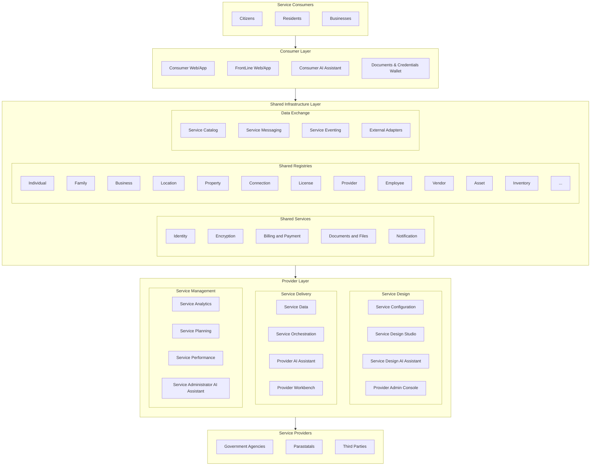

# Service Delivery Architecture

The DIGIT 3.0 Service Delivery Architecture provides a comprehensive framework for connecting citizens with government services while implementing our design principles through concrete patterns and practices. This document details how each architectural layer embodies our principles and leverages specific technology patterns to create a cohesive, effective service delivery platform.

## Architecture Overview

DIGIT's architecture bridges the gap between service consumers and providers through three interconnected layers:

## Consumer Layer: Citizen-Centric Experience

The Consumer Layer serves as the primary interface between citizens and government services, embodying the principles of User-Centered and Inclusive design, and Intelligent service delivery.

### Consumer Registry & Profiles

**Key Components:**
- User registration and identity verification: Securely registers citizens and verifies their identity through various methods.
- Profile management with preference settings: Allows citizens to manage their profiles and set preferences for service interactions.
- Consent management for data sharing: Enables users to control which data is shared with service providers and for what purposes.

### Apps: Web, Mobile & Voice and Front Line

**Key Components:**
- Citizen Portal (web interface): Core web application providing access to all available government services with responsive design.
- Mobile Applications: Native and progressive web apps optimized for mobile devices with offline capabilities.
- Voice Interfaces: Voice-activated service access for inclusive engagement across literacy levels.
- SMS/USSD for feature phones: Basic service access through text messages for citizens without smartphones.
- Front Line worker interfaces: Specialized applications for government field workers to deliver services in-person.
- Assisted access through service kiosks: Public terminals where citizens can access services with assistance.

### Consumer AI Assistant

**Key Components:**
- AI-powered service discovery: Intelligent assistant that helps citizens find relevant services based on their needs and circumstances.
- Application assistance: Guides users through complex service applications with step-by-step support.
- Document preparation guidance: Advises citizens on required documents and how to prepare them correctly.
- Status tracking and updates: Proactive notifications and detailed tracking of service requests.
- Personalized service recommendations: Suggests relevant services based on citizen profile, history, and circumstances.

### Wallet: Documents & Credentials

**Key Components:**
- Digital document storage: Secure personal repository for storing important documents and certificates.
- Verifiable credential management: Storage and management of cryptographically verifiable credentials issued by authorities.
- Selective disclosure capabilities: Enables citizens to share only specific parts of their credentials while maintaining privacy.
- Consent-based sharing: Allows controlled sharing of documents and credentials with explicit user consent.

## Shared Infrastructure Layer: Platform Foundation

The Shared Infrastructure Layer provides core capabilities that can be reused across all services, embodying principles of interoperability, reliability, and scalability.

### Identity: Authentication & Authorization

**Key Components:**
- Authentication services: Securely verifies user identities through multiple factors and methods.
- Authorization frameworks: Controls access to services and data based on user roles and permissions.
- Federation with existing identity systems: Integrates with national IDs and other identity providers for seamless access.
- Role-based access control: Manages permissions based on user roles across the platform.

### Shared Registries and Reference Data

**Key Components:**
- Common registry services (people, businesses, locations): Centralized, authoritative repositories of core entities used across services.
- Cross-sector reference data: Standardized reference information shared across multiple services and sectors.
- Master data management: Ensures consistency and quality of shared data across the platform.
- Data governance: Policies and processes that ensure data quality, privacy, and appropriate usage.

### Encryption: Security Services

**Key Components:**
- Key management: Creation, storage, and rotation of encryption keys across the platform.
- Document encryption: Secures sensitive documents through encryption at rest and in transit.
- Digital signing: Ensures authenticity and integrity of documents and transactions.
- Certificate management: Issues and manages digital certificates for secure communications.

### Billing and Payment: Financial Transactions

**Key Components:**
- Billing and demand generation: Creates and manages bills for government services and taxes.
- Payment processing: Securely processes payments through multiple channels and methods.
- Receipt management: Generates and stores official receipts for all transactions.
- Integration with payment gateways: Connects with multiple payment providers to offer citizens flexibility.

### Documents and Files

**Key Components:**
- Document storage and management: Centralized system for storing and organizing documents across services.
- File versioning: Tracks changes to documents over time with version history.
- Content indexing: Makes document content searchable across the platform.
- Media storage: Handles various media types including images, audio, and video files.
- Archival services: Long-term preservation of documents with compliance to retention policies.

### Notification: Communication Services

**Key Components:**
- Multi-channel messaging (email, SMS, push): Delivers notifications through users' preferred channels.
- Templating engine: Creates consistent, personalized messages across all communication channels.
- Delivery status tracking: Monitors notification delivery and receipt to ensure communications are received.
- Notification preferences: Allows users to set preferences for how and when they receive notifications.

### Data Exchange: Integration Services

**Key Components:**
- Service request/response routing: Directs service requests to appropriate providers and returns responses.
- External system integration: Connects with legacy systems and third-party services through standardized interfaces.
- Event publication and subscription: Facilitates real-time data sharing through event-driven architecture.
- API management: Controls, secures, and monitors API access across the platform.

## Provider Layer: Government Service Enablement

The Provider Layer empowers government agencies to design, deliver, and optimize public services through configurable tools and frameworks.

### Service Management: Service Design & Administration

#### Provider Registry & Profile

**Key Components:**
- Agency onboarding: Process for registering and configuring new service providers on the platform.
- Service provider configuration: Tools for agencies to set up their service offerings and workflows.
- Multi-tenancy management: Enables multiple agencies to operate independently within the shared platform.
- Role and permission management: Administration of roles and permissions for service provider staff.

#### Service Catalog

**Key Components:**
- Service metadata management: Centralized repository of information about all available services and their requirements.
- Service discovery: Tools and interfaces to help citizens and providers find relevant services.
- Eligibility rules: Configurable rules to determine service eligibility based on citizen attributes.
- Documentation and help: Comprehensive guidance for service access, usage, and troubleshooting.

#### Service Studio: Low-Code Service Design

**Key Components:**
- Form builder: Visual tools for creating and customizing service application forms without coding.
- Workflow designer: Graphical interface for defining service delivery processes and approval flows.
- Integration configurator: Tools to connect services with data sources and other systems without coding.
- Business rule engine: Configuration-based rules for service eligibility, validation, and processing.

#### Administrator Console: System Management

**Key Components:**
- System configuration: Centralized interface for configuring platform settings and service parameters.
- User management: Tools for managing administrator accounts, permissions, and access.
- Monitoring dashboards: Visual displays of system health, performance, and service metrics.
- Audit logs: Comprehensive records of system activities for security and accountability.

### Service Delivery: Request Processing

#### Sectoral Registries and Reference Data

**Key Components:**
- Sector-specific master data: Specialized data repositories for specific domains like healthcare, education, or taxation.
- Domain registries: Authoritative records for sector-specific entities and relationships.
- Specialized reference data: Sector-specific codes, classifications, and reference information.
- Service-specific data repositories: Dedicated data stores for individual service operations and records.

#### Service Orchestration

**Key Components:**
- Request management: Tracks and manages service requests from submission to fulfillment.
- Form processing: Validates and processes submitted forms, extracting structured data.
- Document validation: Verifies submitted documents for authenticity and completeness.
- Status tracking: Provides real-time visibility into service request progress.
- Process automation: Automates routine steps in service delivery workflows.
- Task assignment: Routes tasks to appropriate staff based on roles and workload.
- SLA monitoring: Tracks service delivery against defined service level agreements.
- Escalation paths: Automated escalation of delayed or problematic service requests.

#### Employee AI Assistant

**Key Components:**
- AI-powered decision support: Provides recommendations to staff based on policy, precedent, and case details.
- Contextual information retrieval: Surfaces relevant information from knowledge bases and prior cases.
- Process guidance: Assists employees through complex procedures with step-by-step guidance.
- Policy interpretation: Helps staff apply policies correctly through AI interpretation of regulations.
- Case handling recommendations: Suggests next actions based on case specifics and similar past cases.

#### Employee Workbench: Staff Interfaces

**Key Components:**
- Case processing: Unified interface for staff to review and process service requests.
- Document management: Tools for staff to access, review, and manage citizen-submitted documents.
- Decision support: Features that help staff make informed decisions on service requests.
- Inter-department coordination: Tools for collaboration across departments on complex service requests.

### Service Intelligence: Analytics & Optimization

#### Service Analytics

**Key Components:**
- Service usage analytics: Tracks and analyzes how services are being used by citizens and staff.
- Performance dashboards: Visual displays of key performance indicators for service delivery.
- Trend analysis: Identifies patterns and trends in service usage and delivery over time.
- Custom reports: Configurable reporting tools to answer specific business questions.

#### Service Planning: Resource Optimization

**Key Components:**
- Demand forecasting: Predicts future service demand based on historical data and external factors.
- Capacity planning: Tools to align staffing and resources with anticipated service demand.
- Resource allocation: Optimizes distribution of resources across services and locations.
- Scenario modeling: Simulates different operational scenarios to inform planning decisions.

#### Service Performance: Quality Management

**Key Components:**
- SLA monitoring: Tracks actual service delivery times against committed service levels.
- Quality metrics: Measures various dimensions of service quality beyond just processing time.
- User satisfaction tracking: Collects and analyzes citizen feedback on service experiences.
- Continuous improvement tools: Identifies bottlenecks and improvement opportunities in service delivery.

#### Administrator AI Assistant

**Key Components:**
- AI-powered system management: Intelligent assistance for platform administrators with configuration and troubleshooting.
- Configuration recommendations: Suggests system settings based on usage patterns and best practices.
- Anomaly detection and diagnosis: Automatically identifies unusual patterns that may indicate issues.
- Policy compliance monitoring: Ensures services are delivered in compliance with regulations and policies.
- Performance optimization suggestions: Recommends adjustments to improve system efficiency and responsiveness.

## Cross-Cutting Capabilities

These capabilities span all layers of the architecture, ensuring consistent implementation of key principles:

### Security & Privacy Framework

**Key Components:**
- Identity and access management: Comprehensive system for managing identities and controlling access across the platform.
- Data protection: Security measures to protect data confidentiality, integrity, and availability at all levels.
- Secure communications: Encrypted and authenticated communications between all system components.
- Privacy controls: Features that enforce privacy policies and protect personal information throughout the system.

### Observability Platform

**Key Components:**
- Monitoring: Continuous tracking of system health, performance, and business metrics across all services.
- Logging: Comprehensive recording of system events for troubleshooting and audit purposes.
- Tracing: End-to-end visibility into transaction flows across distributed system components.
- Alerting: Proactive notification of potential issues based on defined thresholds and conditions.

### Interoperability Framework

**Key Components:**
- API standards: Consistent patterns and formats for APIs across the platform to facilitate integration.
- Data exchange formats: Standardized data structures for information sharing between components and external systems.
- Integration patterns: Reusable approaches for connecting system components and external services.
- Standards compliance: Adherence to national and international standards for data and service interoperability.

### Extensibility Framework

**Key Components:**
- Plugin architecture: Modular design that allows new capabilities to be added without modifying core systems.
- Extension points: Well-defined interfaces where custom code can extend platform functionality.
- Configuration framework: Tools and patterns for customizing behavior without programming.
- Service templates: Reusable patterns and components to accelerate new service development.

## Summary

This detailed Service Delivery Architecture demonstrates how DIGIT 3.0 implements its design principles through concrete patterns and practices across all layers of the system. By connecting service consumers with providers through a shared infrastructure, it enables governments to deliver citizen-centric, efficient, and inclusive services while maintaining security, interoperability, and scalability.

The architecture supports the complete citizen service journey—from discovery to fulfillment—while giving government agencies the tools they need to design, deliver, and optimize their services. The multi-tenant approach allows different departments to maintain their own service configurations while sharing common infrastructure, reducing costs and promoting standardization. 