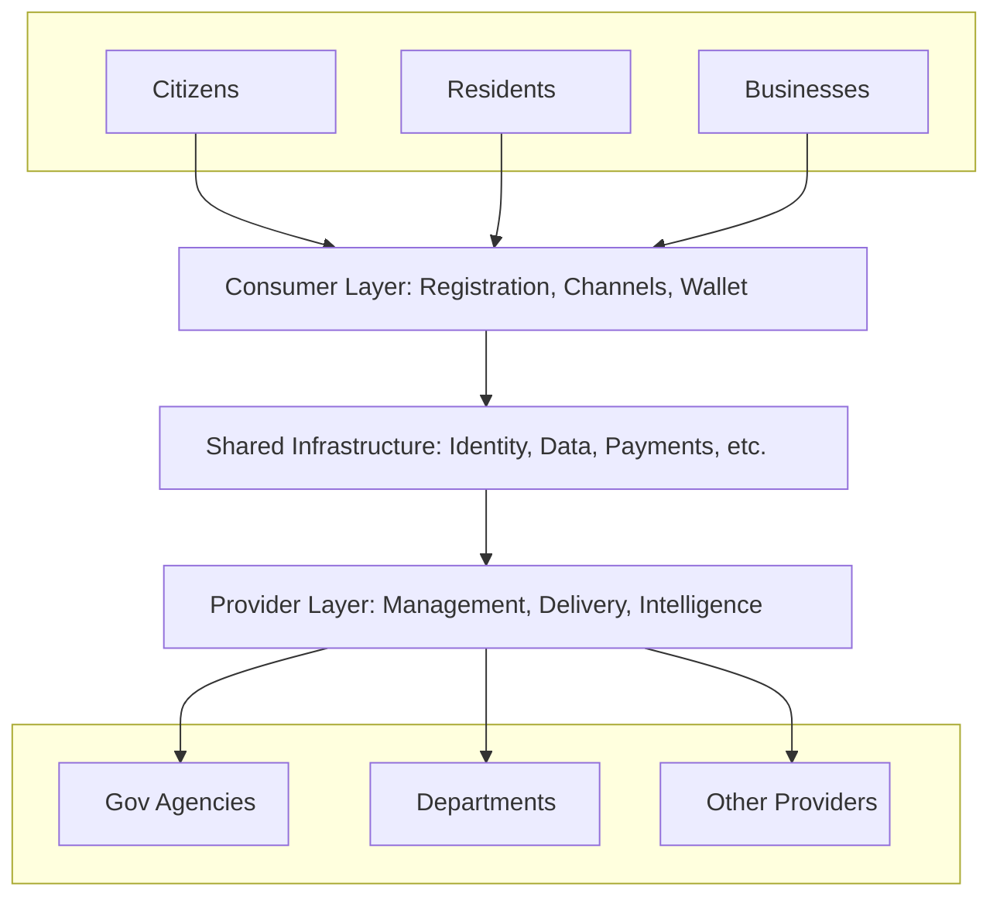

## Status

This project is currently in active development. The documentation outlines the intended features and structure of the platform. Expect changes, and contributions are welcome!

## DIGIT 3.0

DIGIT 3.0 is an open source, citizen-centric platform designed to transform how governments deliver public services. Built on the principles of digital public infrastructure, it provides governments with a flexible, modular toolkit to create inclusive, accessible, and efficient service delivery systems. DIGIT 3.0 focuses on the complete citizen journey—from service discovery to fulfillment—while giving governments the tools to streamline operations, integrate disparate systems, and make data-driven decisions. As a global public good, DIGIT 3.0 empowers governments of all sizes to build sovereign digital capabilities without vendor lock-in or proprietary constraints.

### What is Public Service Delivery?

Public service delivery encompasses the systems and processes through which governments provide essential services to citizens—such as water, sanitation, healthcare, education, welfare, and civil registration. From a citizen perspective, it represents the primary touchpoint with government, where public needs are addressed through efficient, user-friendly interactions that minimize bureaucracy and maximize value.

Citizens typically interact with public services through key stages of a journey:

1. **Discovery** - Finding and learning about available services
2. **Information** - Understanding eligibility, requirements, and processes  
3. **Application** - Submitting service requests and required information
4. **Documentation** - Uploading supporting documents and evidence
5. **Payment** - Paying applicable fees and charges
6. **Tracking** - Monitoring application status and progress
7. **Communication** - Receiving notifications and updates
8. **Fulfillment** - Receiving the service outcome or benefit
9. **Feedback** - Providing input on service quality
10. **Post-delivery** - Accessing certificates, renewals, or follow-up services

When delivered effectively, these services improve well-being, equity, and public trust.

### Challenges in Public Service Delivery Digitization

Governments around the world have made significant strides in digitising public service delivery. However, most early systems were siloed vertical applications or monolithic ERP implementations. While they addressed immediate needs, they introduced long-term challenges:

- Fragmented data requiring citizens to repeatedly provide the same information
- Disconnected tools forcing government employees to navigate multiple systems
- Lack of real-time visibility for administrators to monitor service delivery
- Rigid, unscalable architectures with high vendor lock-in

Access to public services remains uneven—especially for marginalised communities—due to manual processes, complex bureaucracy, and limited transparency. Citizens often face multiple barriers including:

- Inconsistent information across different government channels
- Cumbersome application processes requiring multiple in-person visits
- Limited visibility into application status and decision-making
- Difficulty accessing services in their preferred language or format
- Lack of accessible options for persons with disabilities

### Why DIGIT: A New Approach to Digital Public Service Delivery

DIGIT represents a new phase of digital transformation—one that is modular, interoperable, and citizen-centric. It enables governments to build inclusive, accessible, and accountable digital infrastructure for public service delivery.

With DIGIT, governments can:

- Deliver services through a common infrastructure, reducing duplication
- Create unified citizen interfaces that simplify discovery and access
- Implement digital workflows that increase transparency and efficiency
- Adopt open standards that promote ecosystem collaboration
- Deploy configurable components that support local adaptation
- Reuse data and processes across departments
- Support inclusive service access in multiple languages and formats
- Monitor operations in real-time and make data-driven decisions

Its suite of backend services and frontend applications are modular, configurable, and extensible—allowing local customisation while preserving platform consistency. DIGIT helps governments modernise service delivery processes through integrated digital infrastructure, streamlined workflows, and citizen-friendly interfaces.

### DIGIT in Action

DIGIT 3.0 supports the complete citizen service journey—from discovery to fulfillment—through a shared digital infrastructure that multiple government agencies can leverage. By enabling multi-tenancy, DIGIT allows different departments and levels of government to transform their service delivery while sharing common services, data registries, and infrastructure costs.

#### Service Delivery Architecture

DIGIT's architecture consists of three primary layers that work together to create a seamless public service delivery ecosystem:

1. **Consumer Layer**: Provides citizens with a unified service experience through consumer registration, multi-channel access, and document/credential management.

2. **Shared Infrastructure Layer**: Enables data sharing, reuse, and interoperability with services for identity, data, encryption, payment, notification, and data exchange.

3. **Provider Layer**: Empowers government agencies to streamline service delivery through service management, service delivery, and service intelligence components.

For detailed information on the Service Delivery Architecture, see [Services](Architecture/Services/Services.md).

DIGIT 3.0 is designed to make public service delivery more accessible, efficient, and inclusive while reducing the total cost of ownership for governments.

## Design Principles

DIGIT's architecture and implementation are guided by the following principles that ensure it meets the needs of governments, citizens, and the broader digital ecosystem. These principles reflect best practices in building digital public infrastructure that is secure, inclusive, and sustainable.

### 1. Security and Privacy

Ensure that all citizen data is handled securely and respectfully. Build in encryption, access controls, and consent management. Prevent data misuse through auditability and responsible data handling.

### 2. Single Source of Truth

Avoid data duplication and contradictions by establishing authoritative registries and event-driven data sharing. Enable reliable, consistent decision-making across services.

### 3. Reliable and Cost-Effective

Design for high availability, graceful degradation, and infrastructure efficiency. Reduce downtime risks while optimising for public sector budgets.

### 4. Scalable and Performant

Ensure services remain fast and responsive under increasing load. Use stateless components, asynchronous processing, and distributed design.

### 5. User-Centered and Inclusive

Design for diverse users—citizens, employees, vendors, and administrators. Support local languages, accessibility, and multi-modal interaction including voice. Respect privacy and support low-literacy and low-connectivity use cases.

### 6. Observable and Transparent

Enable audits, real-time monitoring, and citizen visibility into service processes. Publish logs, events, and metrics to promote accountability and trust.

### 7. Interoperable

Support open APIs, common data formats, and event standards to enable systems to work together. Promote ecosystem collaboration over vendor lock-in.

### 8. Open Source

Foster transparency, auditability, and community contribution through open licensing. Allow governments to inspect, adapt, and extend software freely.

### 9. Modular and Evolvable

Structure the platform as a set of independent, composable services. Enable independent upgrades, localisation, and extension without disrupting the whole system.

### 10. Configuration-First and Extensible

Empower business users to define services without writing code. Use declarative, low-code approaches with options for technical extension through plugins and APIs.

### 11. Intelligent

Leverage data and AI to support personalisation, prediction, and decision support. Use analytics to improve policy, target delivery, and proactively detect service issues using GIS, IoT, and other signals.

## Getting Started

Explore the following to get started:

- [Practices and Patterns](Practices%20and%20Patterns/Principles.md) - Implementation of our [Design Principles](#design-principles) through concrete patterns
- [Architecture](Architecture) - Technical foundation and structure of the DIGIT platform
  - [Services](Architecture/Services/Services.md) - Service Delivery Architecture
  - [Apps](Architecture/Apps) - Frontend applications and user interfaces
  - [Data](Architecture/Data) - Data models, storage, and management strategies
  - [Infrastructure](Architecture/Infrastructure) - Deployment infrastructure and configuration
  - [Technology](Architecture/Technology) - Technology stack and component choices
  - [Security](Architecture/Security) - Security implementation and best practices
  - [Multi-Tenancy](Architecture/Multi-Tenancy) - Supporting multiple organizations on a shared platform
- [Specifications](Specifications) - Detailed technical specifications and interfaces
  - [APIs](Specifications/APIs.md) - API documentation, standards, and examples
  - [Common](Specifications/Common) - Shared models, patterns, and standards
- [Guides](Guides) - Practical how-to documentation for implementation
- [Governance](Governance/Governance.md) - Project governance model and decision-making processes
- [Community](Community) - Join the DIGIT community
  - [Contribution Guidelines](Community/Contribution.md) - How to contribute to the platform
  - [Code of Conduct](Community/CODE_OF_CONDUCT.md) - Standards for community participation