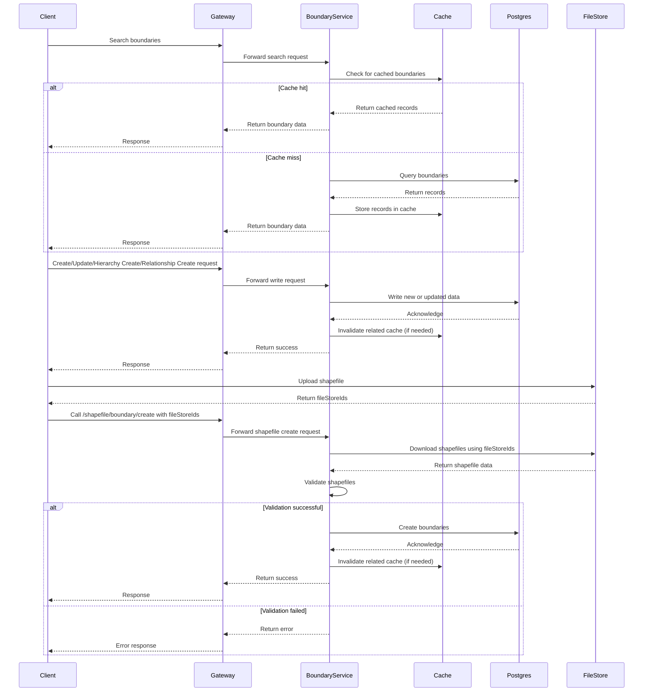

### Introduction
The Boundary Service is a core component of the DIGIT platform that manages boundaries across multiple tenants. It supports creating, updating, and searching boundaries, as well as defining hierarchies and relationships between them. The service also enables bulk ingestion of geospatial data through shapefile uploads, ensuring accurate and validated boundary management. This allows cities and states to maintain robust, flexible, and hierarchical spatial data structures.

### Create Boundary 
The Create Boundary API introduces functionality to define your boundary entities with all required validations and properties. It uses GeoJSON standards for geometry definitions.
* Supported geometry types: MultiPolygon, Polygon and Point.
* You can define hierarchical or flat boundaries depending on your use case.
* Example use cases: defining wards, blocks, zones, localities.

### Search Boundary 
The Search Boundary API enables searching for boundary entities.
* Mandatory parameters: tenantId and codes.
* Returns boundary entities that match the provided identifiers.
* Useful for retrieving specific administrative or revenue boundaries.

### Update Boundary 
The Update Boundary API allows modifying an existing boundary entity's geometry.

* Supports changes to MultiPolygon,Polygon or Point geometry.
* Used for correcting or adjusting boundary shapes after validation or surveys.

### Create Boundary Hierarchy Definition
This API defines hierarchy structures for boundaries within a tenant.

* You can predefine parent-child relationships (e.g., City → Zone → Ward → Locality).
* Once defined, these hierarchies can be used while creating relationships among boundaries.

### Search Boundary Hierarchy Definition
This API searches existing hierarchy definitions. If hierarchyType is not provided, it returns all hierarchies for the given tenant.

### Create Boundary Relationship
The Create Boundary Relationship API establishes parent-child links between boundary entities.
* Validations:
    * Checks if the parent relationship is already established.
    * Ensures that boundaryType is a direct descendant of the parent’s type as defined in the hierarchy definition.
    * This enforces data consistency in multi-level administrative structures.

### Search Boundary Relationship
This API searches for relationships among boundaries. Enables querying complete tree structures or fetching immediate parents/children based on need.

### Update Boundary Relationship
This API allows updating a boundary entity’s parent within the same hierarchy level.

* Enforces hierarchy constraints.
* Ensures the updated parent is valid according to the pre-defined hierarchy definition.

### Shapefile Upload and Boundary Creation
The Shapefile Upload API allows bulk creation of boundary entities from uploaded shapefiles.

* Clients first upload shapefiles to the FileStore service and receive fileStoreIds.
* These fileStoreIds, along with tenantId and uniqueCodeField (used to determine unique boundaries), are passed to the /shapefile/boundary/create endpoint.
* The service downloads and validates shapefiles before creating boundaries.
* Useful for importing large sets of geospatial boundary data efficiently.

### Usage Summary
These entity APIs allow complete lifecycle management of boundary data, enabling cities and states to maintain accurate, validated, and hierarchical boundary definitions across administrative systems.

