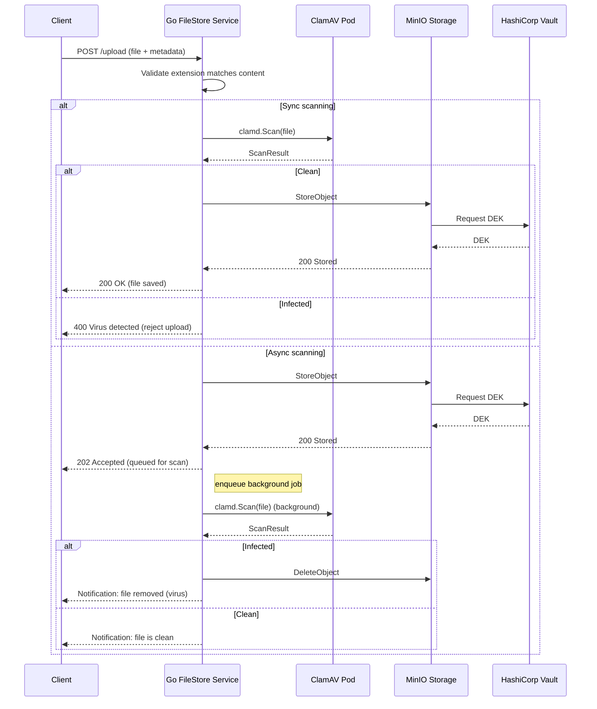
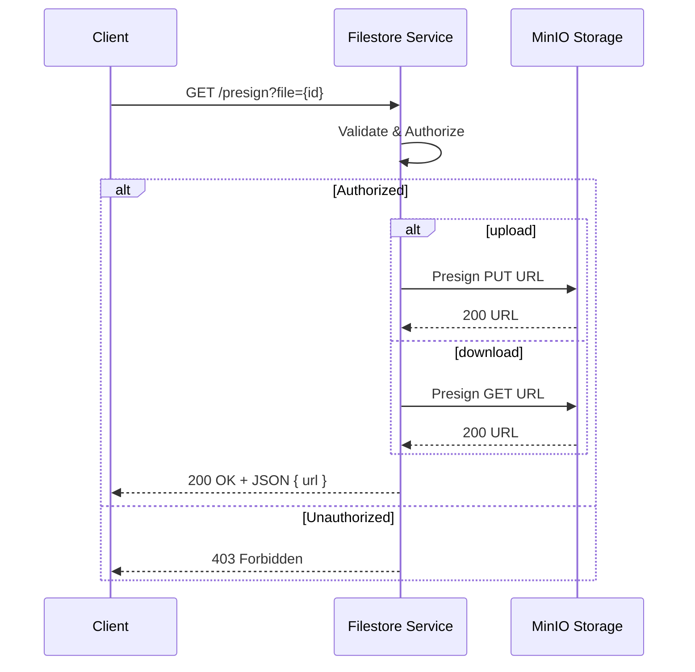
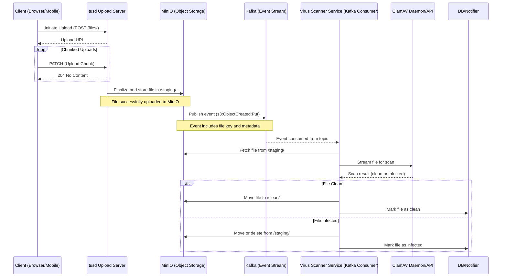

# Filestore Technical Overview

🚧 **Work in Progress**  
_This documentation is actively being refined. Contributions and suggestions are welcome._

## 1. Overview
The Filestore Service is a Go-based microservice that provides secure, scalable file storage with built-in malware protection and content validation. It leverages MinIO (integrated with HashiCorp Vault for envelope-style encryption) as the object store, and ClamAV for virus scanning. Depending on your configuration, uploads can be scanned synchronously—blocking until the result is known—or queued for asynchronous background inspection. Any file whose extension doesn’t match its actual content, or which tests positive for malware, is automatically rejected or purged.

## 2. Flow Digram

### 1. Upload File

When a client submits a file for upload, the service first inspects the file’s extension against its content to guard against spoofing. Depending on the configured mode, the file is either scanned immediately (synchronous) or queued for later analysis (asynchronous). In synchronous mode, the service calls ClamAV and, if the file is clean, requests a data‐encryption key (DEK) from HashiCorp Vault before handing the encrypted payload off to MinIO; any virus detection aborts the upload. In asynchronous mode, the file is optimistically stored—MinIO automatically contacts Vault to retrieve and apply the DEK—then the service enqueues a background scan; infected files are purged post-scan and the client is notified of the removal, while clean files remain accessible.

### 2. Get Pre-signed URL

In this flow, the client sends a request to the Filestore Service’s /presign endpoint, including the file identifier. Authentication is handled upstream by the API gateway before the request reaches the service. Once received, the Filestore Service requests a presigned URL from MinIO. MinIO returns a time-limited URL, which the service wraps in a JSON response and sends back to the client. This presigned URL allows the client to interact directly with MinIO to upload or download the file securely within the allowed time window.

### 3. Resumable File Upload

To support large file uploads and provide resilience against unstable network connections, the system uses tusd, the official reference implementation of the TUS protocol—an open standard for resumable uploads. tusd allows clients (browsers or mobile apps) to upload files in chunks, with the ability to pause and resume uploads without starting over. Uploaded files are initially stored in a designated staging area within MinIO, an S3-compatible object storage system. Upon successful completion of the upload, MinIO generates an s3:ObjectCreated:Put event, which is published to a Kafka topic via MinIO's bucket notification system. A dedicated scanner service consumes these Kafka events, retrieves the uploaded files from the staging path, and scans them using ClamAV to detect any viruses or malware. Based on the scan result, the file is either moved to a clean storage location or quarantined/deleted. This design decouples upload handling from virus scanning, ensuring high reliability, scalability, and secure file processing across the system.

