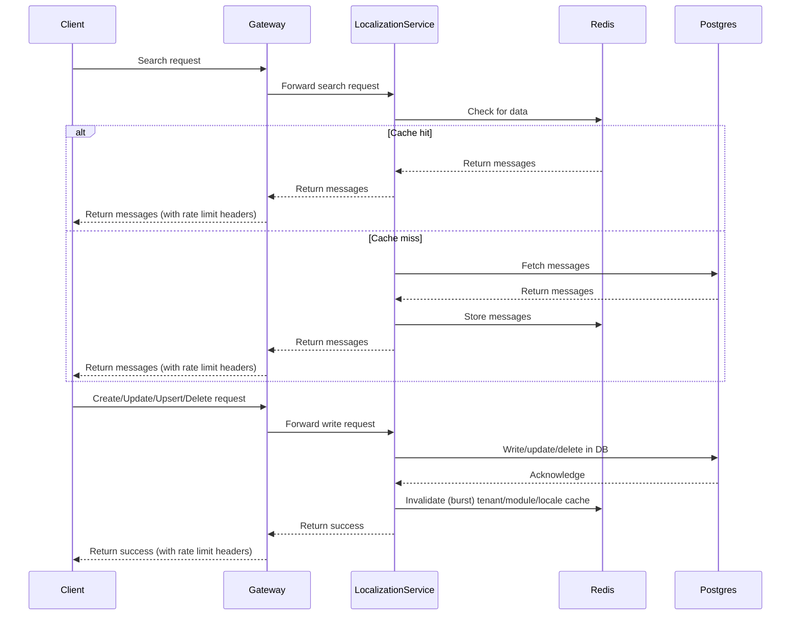

# Localization Service Technical Overview
## Overview
The Localization Service API provides endpoints to manage and retrieve localization messages for applications. It supports creating, updating, deleting, searching, and identifying missing message keys per tenant and locale.

### Search Flow
#### Description
When the client requests messages (search), the service prioritizes performance and low latency by first checking a Redis cache.

#### Detailed Steps
1. Client sends a search request (optionally with filters: module, locale, codes) to the Gateway.
2. Gateway forwards the request to the Localization Service.
3. The Localization Service checks Redis cache using the tenant, module, and locale keys.
4. Cache hit: Messages are fetched directly from Redis and returned.
5. Cache miss: Messages are fetched from Postgres DB, stored back in Redis, and then returned to the client.
6. Gateway enriches the response with rate-limiting headers (e.g., X-Rate-Limit, X-Rate-Limit-Remaining, etc.) before returning to the client.
   
### Create, Update, Upsert, Delete Flows
#### Description
Whenever messages are created, updated, upserted, or deleted, the cache must be invalidated to ensure consistency.

#### Detailed Steps
1. Client sends a modification request (create, update, upsert, delete) to the Gateway.
2. Gateway forwards the request to the Localization Service.
3. The Localization Service performs the database write (Postgres).
4. Once the DB operation is successful, the service invalidates (bursts) the Redis cache for the affected tenant, module, and locale combination.
5. Localization Service returns a success response to the Gateway.
6. Gateway enriches the response with rate-limiting headers and sends it back to the client.

### Missing Messages API Flow
#### Description
This API helps identify keys that are not defined for certain locales within a tenant. It ensures all locales have a consistent set of messages, crucial for maintaining a complete multilingual user experience.

#### Logic
* The service first computes the intersection of all message keys defined across all locales for the tenant (i.e., the common set of keys that should exist everywhere).
* Then, for each locale specified in the request, it compares the locale's keys to this intersection.
* Any missing keys for each locale are returned in the response.

#### Steps
1. Client sends a missing messages request, optionally specifying a list of locales to check.
2. If no locales are provided, all locales in the tenant are checked.
3. Gateway forwards the request to the Localization Service.
4. The Localization Service:
    * Retrieves all keys for the tenant.
    * Calculates the intersection of all keys across locales.
    * Compares each target locale's keys with the intersection and identifies missing ones.
5. Returns a map of each locale to its list of missing keys.
6. Gateway enriches the response with rate-limiting headers and forwards to the client.

#### Example Response
    {
      "en_IN": ["WELCOME_MESSAGE", "LOGOUT_BUTTON"],
      "fr_FR": ["WELCOME_MESSAGE"]
    }
### Caching & Invalidation Strategy
* Read optimization: The service always checks Redis cache first during search.
* Cache fallback: On miss, data is fetched from Postgres, stored in Redis, and then returned.
* Write operations: Cache is burst/invalidation-based, meaning the entire set of keys for the specific tenant, module, and locale is cleared after changes to avoid stale data.

### Notes on Gateway Responsibilities
* Adds headers like X-Rate-Limit, X-Request-ID, X-Correlation-ID, etc.
* Handles rate-limiting logic centrally before responding to clients.

