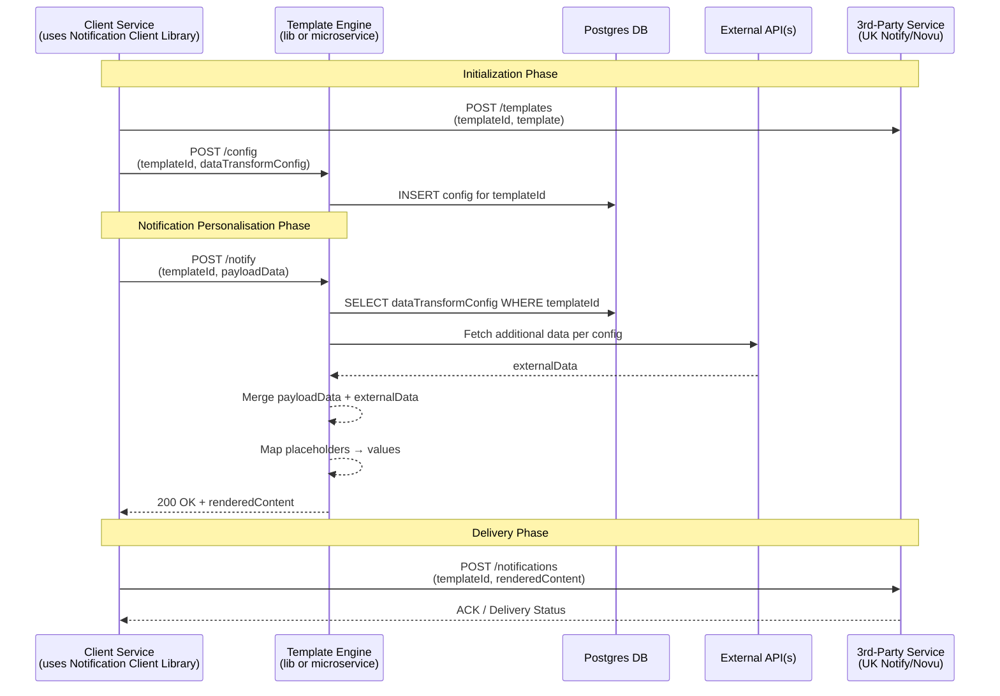

## Notification Service Technical Overview

🚧 Work in Progress
This documentation is actively being refined. Contributions and suggestions are welcome.

The Notification Service provides a robust, extensible framework for turning raw event data into delivered messages across multiple channels.  At its core, the service ingests a `templateId` 
and a payload of business data, applies any configured enrichment rules (such as external API lookups), and produces a fully populated message body.  Templates themselves live on third-party platforms 
like Novu or UK Notify—both require that message definitions be stored and versioned on their end—while our service retains only the transformation logic and configuration in a Postgres database.

The Template Engine—used as either an embeddable library or standalone microservice—owns only the data-transformation logic: it loads a data mapping configuration (stored in Postgres keyed by templateId),
fetches any additional data via external API calls, and merges that with incoming payloads to produce a fully rendered content object. By decoupling this step, the engine remains agnostic of delivery 
mechanisms and can be developed, tested, and versioned independently. It can also be re-used by other services.

For actual dispatch, client services link against a lightweight Notification Client library rather than invoking the third-party APIs directly. At initialization, the client registers raw message
templates with providers such as Novu or UK Notify (both of which require that templates reside on their platforms and be referenced by templateId). At send time the client calls POST /notify on
the Template Engine, receives back rendered content, and then uses the Notification Client to call the provider’s POST /notifications?templateId={…} endpoint.

